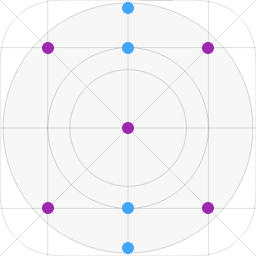
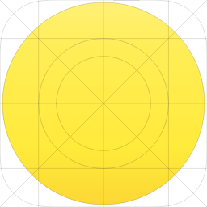
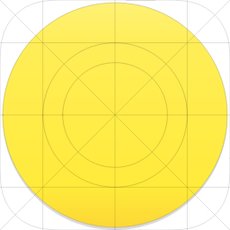
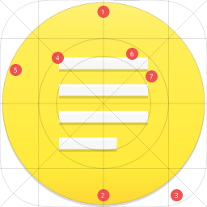

Temos como objetivo a criação de ícones arredondados.
Os ícones panda são projetados para serem utilizados no sistema operacional Deepin.
Licenciado sob licença GPLv3.

## Guia rapido
Faça o download do arquivo inicial neste [link](assets/panda.gvdesign), após o termino deste procedimento será necessário acessar o aplicativo __gravit designer__ para que possam criar novos ícones. Vocês poderam acessar o modo online através deste [link](https://designer.gravit.io/) ou fazer o download da aplicação adequada para seu sistema operacional neste [link](https://designer.io/).

### Criando o seu primeiro ícone
Com o ícone base você terá acesso ao designer básico onde poderá trabalhar da forma que achar melhor respeitando algumas regras. Não é permitido a alteração da cor da sombra base que atualmente é #000000 com opacidade de 15%.

### Cores
Vamos precisar definir os padrões de cores para termos consistencia visual, Eu estarei trabalhando com as seguintes cores: #FFF176, #FFEE58, #FFEB3B, #FDD835, #F7F7F7 e #FFFFFF.

### Gradiente
Irei trabalhar com o gradiente linear dentre as demais opções disponíveis, utilizando as guia horizontais teremos os pontos base recomendados. (Eu estarei trabalhando com os pontos azul presentes na imagem abaixo).

Após aplicar o gradiente, teremos algo similar ao exemplo abaixo:

## Sombra
A sombra principal possui cor #000000 com transparência de 15%, este valor é unico e não deve ser modificado. (pre-visualização abaixo)

## Forma
No caso de estar utilizando gradiente, lembre-se de alterar a sombra das formas para #00000 e adicionar transparencia entre 15 a 30%. valor padrão atribuido é de 15%.

Explorando detalhes adicionais

* 1 - Ponto de Luz.
* 2 - Ponto de Sombra.
* 3 - Ponto de Sombra.
* 4 - Limitador de ícones (Todas as formas devem ficarem dentro do limitador, a exeção a regra é para ícones específicos por tanto cabe ao designer julgar necessário ou não).
* 5 - Bordas (Também devem respeitar os pontos de luz e sombra) Opcional
* 6 - Ponto de Luz (Forma) Opcional
* 7 - Ponto de Sombra (Forma) Requerido

Resultado final

